# External Flash Integration
In this chapter the software architecture for implementing an external flash is described. The ruuvi sensor includes an internal flash with 56 Kbyte. To show the benefit of an external flash, the following example analyzes how long data can be recorded in each case. Using the internal FIFO that has storage space for 32 acceleration data samples and a configuration of:  

 * 10 Hz frequency  
 * 12 bit of data resolution  

144Byte of data are written to the internal flash every 3,2s. That allows logging data for 1244 s.  
Implementing the external flash from Macronix with a size of 64Mbit and the same configuration as above allows logging for 51,756 h.  

## Macronix Flash 
Next, an overview on general parameters of the Macronix flash is given. The MX25R6435F is a serial NOR flash with 64Mbits. It promises a minimum of 100.000 erase/program cycles and 20 years of data retention.  
Further, the flash has a status register that indicates its status and a configuration register which can change the default status of the chip. Program commands can be executed on byte, page (256 bytes), or word basis while erase commands can be executed on sector (4K-byte), block (32K-byte), block (64K-byte) or whole chip basis.  
For testing the “tag connector” is used where the following pins are defined for the SPI bus:  

| SPI | PIN |
| - | - |  
| MOSI | 30 |  
| MISO | 31 |  
| SCK | 20 |  
| SS | 16 |  

When the external flash is included on the PCB, the pins for the SPI bus must change to:  

| SPI | PIN |  
| - | - |  
| MOSI | 23 |  
| MISO | 22 |  
| SCK | 24 |  
| SS | 11 |  

The following picture showes the setup:  
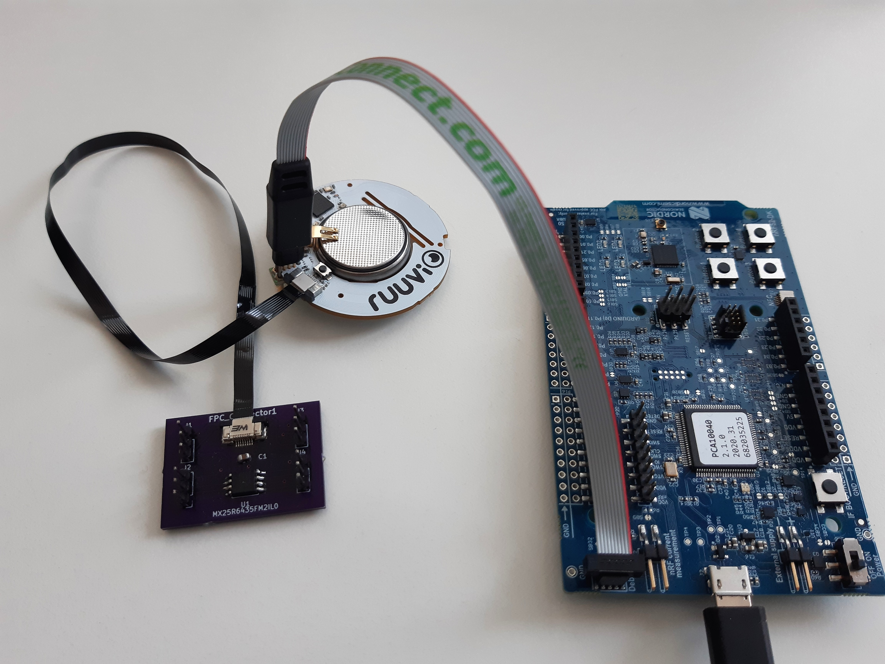  

## Database vs. Filesystem 
For data management on the flash, a database is needed. An alternative is, to use a file system. For the decision, the following characteristics of each option are considered:  

| Database | Filesystem |  
| - | - |  
| Related, structured data | Good with unstructured data |  
| Data with defined formats | Small overhead |  
| Efficient for insert, update and/or retrieval |  |  

As a first approach, the database FlashDB is used. The acceleration data is structured, the order of the incoming data and its timestamp is of interest. That is provided by the time series data base (TSDB). Another useful functionality is the key value data base (KVDB), supported by the FlashDB, that allows storing the configuration. Also, the KVDB provides efficient storage of pre-processed data, which is a possible requirement in future.  

### FlashDB 
“Flash DB is an ultra-lightweight embedded database that focuses on providing data storage solutions for embedded products.” [https://github.com/armink/FlashDB] The DB promotes with a strong performance and reliability including a Power-off protection function and wear balance to extend Flash life. It ensures extremely low resource occupation, ram usage of almost 0 and a very small footprint. Also, multiple partitions and multiple instances are supported. The FlashDB uses sectors which are the smallest unit for formatting. As mentioned above, there are two database modes:  

**Key-value** database  

 * Non-relational database  
 * Stores data as a collection of key-value pairs, with key as unique identifier  
 * Supports two KV types: string and blob  

**Time Series** database  

 * Stores data in time sequence with timestamp  
 * Has large amount of data storage and high insertion and query performance.  

Reference: [FlashDB by armink](https://github.com/armink/FlashDB)  

## Implementation 
The following chapter is focusing on the software structure, modules and functions successfully utilized to implement the possibility to store data on the external flash by using the database FlashDB.  
The following figure shows the general structure:  
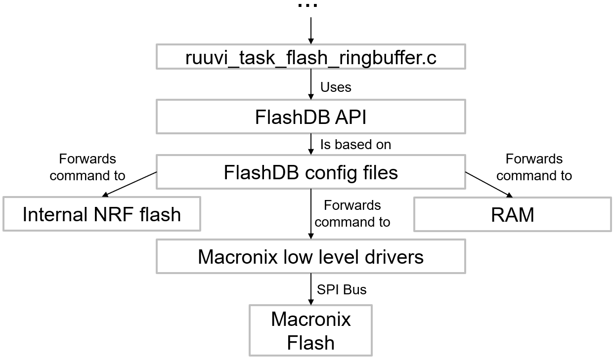
The data collected by the acceleration sensor are passed through several instances and finally end in the module “ruuvi_task_flash_ringbuffer.c” which is responsible for organizing the storage of the collected data through usage of the [API offered by FlashDB](#flashdb-api). FlashDB itself needs some configuration, stored inside its config files, to be able to communicate with the different memory devices. Currently, FlashDB can be operated with three different target memories:   
1.	The internal NRF flash in case the external flash is not present, which gets checked at boot-up  
2.	The external flash to allow maximized data storage  
3.	The RAM to allow direct forwarding of acceleration data to the gateway in the use case of streaming (deprecated)  
As this chapter is discusses the integration of the external Macronix flash chip, the other two devices won’t be considered from here on.  
For FlashDB to be able to access the external flash, an interface to the low-level driver functions is implemented, which forwards the necessary control parameters to the actual driver functions, which communicate with the flash device via SPI bus.  

### FlashDB API 
To administrate the storage independent from the used memory device and from a high-level view, the FlashDB API offers the following functions:  

1. TSDB:   
	* Initialise  
	* Control `void fdb_tsdb_control(fdb_tsdb_t db, int cmd, void *arg)`
   Command control words e.g., Set / Get sector size, Set/ Get lock function, Get the timestamp when TSL was last appended  
	* Append new TSL  
	* Iterative – goes through TSDB, iterative callbacks  
	* Query between timestamps  
	* Set TSL status  
	* Clear TSDB  
	* Convert TSL to blob objects  

2. KVDB:   
	* Initialise  
	* Control `void fdb_kvdb_control(fdb_kvdb_t db, int cmd, void *arg)  `
   Command control words: Set / Get sector size, Set/ Get lock function  
	* Set KV (add a new KV or modify existing KV)  
		+ Set blob type KV, Set string type KV  
	* Get KV  
		+ Get blob type KV, Get KV object, Get string type KV  
	* Initialize KV iterator, Iteration  
	* Delete KV, Reset KV to default  
	* Convert KV to blob objects  
 
For more details: [FlashDB API](https://armink.github.io/FlashDB/#/api)  

### Data Base config files   
The FlashDB config files are stored in \ruuvi.firmware.c\src\ruuvi.libraries.c\src\libs\flashdb. They implement the necessary configuration to be able to access the different storage modules.  

####	fal_cfg.h    
The fal_cfg file defines the available storage partitions to be used by FlashDB inside the FAL_PART_TABLE. The following figure shows the currently defined partitions and their size, once again stressing the huge amount of more available space when using the external flash in contrast to the internal NRF memory.  
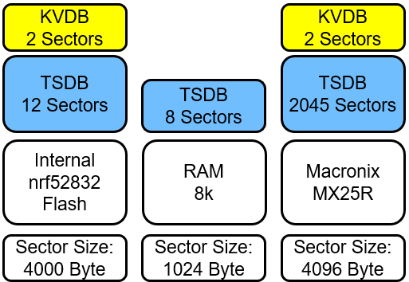  
The small partitions for storing data in the KV format are used for the current sensor configuration while the larger TSDB partitions are utilized to store the acceleration data.  

#### fal_macronix_flash_port.c 
For each of the available memory devices, a flash_port file is defined, which implements the configuration of the device as well as the interface to the low-level driver functions. In the following, the necessary implementations for the external Macronix flash chip are described:  

##### `Const struct fal_flash_dev macronix_flash0` 
Defines macronix flash properties for FlashDB  
1. Name (macronixflash0)  
2. Offset Address (0x000000)  
3. Memory size (2047*4096 Bytes = 8MB)  
4. Block size (4096 Bytes)  
5. Write granularity (0 --> not used)  
6. Available operations (init, read, write, erase)  

##### `Static int init(void)` 
Calls the mx_init() initialization function.   
Returns the status of the initialization function.  

##### `Static int read(long offset, uint8_t *buf, size_t size)` 
Forwards address (offset), the address of the target data buffer (*buf) and the amount of data 	to be read (size) to the according low-level driver function.  
Returns the read size if successful and –1 if an error occurred.  

##### `Static int write (long offset, const uint8_t *buf, size_t size)` 
Ensures that the flash device is ready for data transfer, by calling write enable, checking if 	write enable was set properly and checking the status register if the flash is still busy.  
Also splits the data in multiple separate low-level write function calls if the data is separated 	over multiple flash pages as the Macronix flash is not supporting writing over page borders.  
Returns written size if successful, -1 if an error occurred.  

##### `Static int erase (long offset, size_t size)` 
Ensures that the flash device is ready for data transfer, by calling write enable, checking if write enable was set properly and checking the status register if the flash is still busy.  
Forwards address to "macronix sector erase" low-level driver function.  
--> Database only deletes complete sectors at once  
Returns written size if successful, -1 if an error occurred.  

### Macronix low level driver functions 
The module “maconix_flash.c/macronix_flash.h” located at \ruuvi.firmware.c\src\ruuvi.drivers.c\macronix implements all low-level driver and helper functions necessary to interact with the Macronix flash chip.  

#### `rd_status_t mx_init(void)`    
Checks if SPI bus for macronix flash is already initialized  
If not, defines  
* MOSI, MISO, CLK and SS PINs  
* Frequency, SPI mode and bit order  
Sets all defined SS-PINs as high (not active)  
Definition of SPI-Pins can be changed in macronix_flash.h.  
Returns status code of executed functions, RD_ERROR_INVALID_STATE if bus is already initialized  

#### `rd_status_t mx_read_rems(uint8_t *manufacturer_id, uint8_t *device_id)`   
Reads electronic manufacturer & device ID by  
1. Setting SS LOW  
2. Transferring the command "0x90" via SPI  
3. Receiving the answer  
4. Setting SS HIGH  
5. Assigning the values to the received memory  
Is used to check if the macronix flash is present to decide, which device is used by FlashDB  
Returns Status code of executed SPI functions  

#### `rd_status_t mx_read_status_register(uint8_t *status)` 
Reads Macronix status register and assigns the status of the Write-In-Progress Bit to the received pointer  
Status register also holds:  
1.	Write Enable Latch bit --> set to "1" by "Write Enable" function and reset to "0" after program/erase function terminated  
2.	Block Protect 0 – 3 bits  
3.	Quad Enable bit  
4.	Status Register Write Disable bit --> shows Hardware protection mode (on PIN WP#SIO2)  
Returns Status code of executed SPI functions  

#### `rd_status_t mx_read_config_register(uint8_t *config)` 
Reads Macronix config register and assigns the status of the Low power/High Performance switch bit to the received pointer  
1. TB bit --> decides whether protected area is at top or bottom of flash  
2. L/H switch bit --> Switch between "Ultra Low Power" and "High Performance”  
Returns Status code of executed SPI functions  

#### `rd_status_t mx_read(uint32_t address, uint8_t *data_ptr, uint32_t data_length)` 
Reads from "address" the number of bytes given in "data_length" and returns them inside the "data_ptr".  
MX25R only supports reading of 256 Bytes in 1 call  
--> Loops over multiple read-calls and decreases "data_length" until all desired bytes are read  
Alternative: FAST_READ to read out data until CS is set to high after just one spi call with command and starting address --> not used as FlashDB is not supporting an option for fast read  
Returns Status code of executed SPI functions  

#### `rd_status_t mx_write_enable(void)` 
Sends Write Enable command to flash  
--> needs to be set before every program/erase command  
--> if it is "0" while program/erase command is received, MX25R will ignore the command  
--> can be reset by write disable command, but will be reset after finished program/erase instructions anyhow  
Returns Status code of executed SPI functions  

#### `rd_status_t mx_program(uint32_t address, const uint8_t *data_ptr, uint32_t data_length)` 
Writes from "address" the bytes given in "data_ptr".  
Returns Status code of executed SPI functions  

#### `rd_status_t mx_sector_erase(uint32_t address)` 
Erases the sector (4096 Byte) which is containing the given address  
Is used by FlashDB which is always erasing whole sectors  
Returns Status code of executed SPI functions  

#### `rd_status_t mx_chip_erase(void)` 
Erases the whole chip  
Is used inside rt_reset_macronix_flash() included in ruuvi_task_flash_ringbuffer.c which is called when a ruuvi factory   reset is triggered (by pressing the button on the ruuvi tag for ~10 seconds)  
Returns Status code of executed SPI functions  

#### `rd_status_t ri_spi_xfer_blocking_macronix(const uint8_t *tx, const size_t tx_len, uint8_t *rx, const size_t rx_len)`    
Base function used to pass data to or receive data from the Macronix Flash   
Makes a basic NULL-check to verify that given data length is only NULL if no corresponding command is received   
Only transmits data, if mx_init function is called before (by checking parameter m_spi_init_done)  
--> Uses nrf_drv_spi_transfer function to communicate with SPI device  
Returns Status code of executed SPI functions   

#### `rd_status_t mx_busy(void)`    
Reads status register and returns "RD_ERROR_BUSY" or "RD_SUCCESS" depending on Write-In-Progress bit. Is used by mx_spi_ready_for_transfer.  

#### `rd_status_t mx_check_write_enable(void)`   
Read status register and return "RD_ERROR_BUSY" or "RD_SUCCESS" depending on Write-Enable-Latch bit. Is used by mx_spi_ready_for_transfer.

#### `void mx_spi_ready_for_transfer (void)`   
1.	Waits until flash is not busy  
2.	Sends write enable command  
3.	Waits until write enable latch is set, resends write enable command if it is not  
4.	Waits until flash is not busy  

Used to prepare the flash device before write or erase commands.  

#### `rd_status_t mx_high_performance_switch (bool high_power)` 
Reads the config register and sets the Low-Power / High Performance switch to the value received (High Performance if True, Low power if False) if it is not already the expected value.  
Used to change the power mode to high performance during initialization, discussed in the [next chapter](#flashdb-evaluation).  

## FlashDB evaluation 
The following analysis is done under the configuration described in the introduction ( 12 bit resolution and 10 Hz frequency).  
One block of the Flash consists of 56 byte of block overhead, each time a 144 byte datapacket with acceleration data is written also 16 byte of Overhead and 8 byte for the timestamp are written. The figure below shows the memory distribution at the beginning of a sector.  
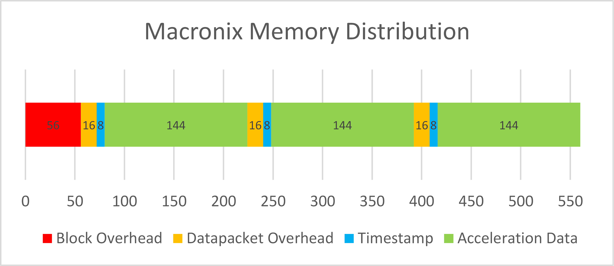  
As the timestamp is considered useful data it is included in the acceleration data and not part of the overhead. A sector is therefore used as described visible below:  
Acceleration Data: 89,06%  
Overhead: 10,74%  
Unused Space: 0,20%  
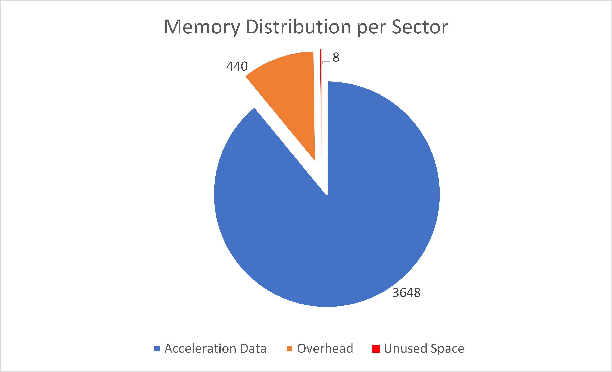  
Finally for evaluating the memory usage of the FlashDB, a similar analysis as in the introduction is carried out. Here it is analyzed, how long acceleration data can be logged. The first bar is the external flash, then, 49,03 h are possible without using the FlashDB and 5,4 h are lost when using the FlashDB.  
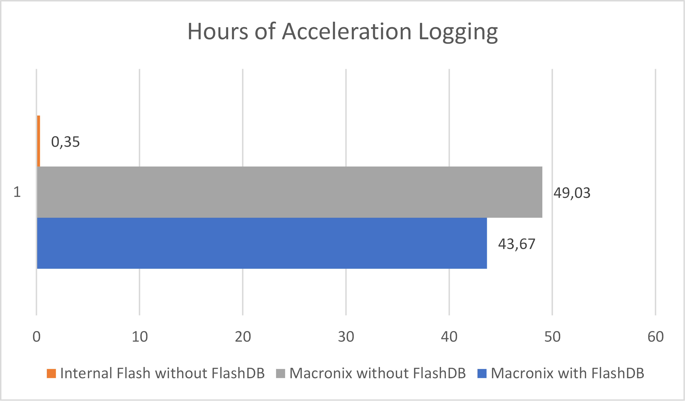  

### Amount of data wich can be stored 
The maximum amount of acceleration data which can be stored inside the available flash memory can be computed using the following formula.

$$T_{storable} = \frac{32}{f_S} * blockcount*{\rm floor}\left(\frac{blocksize-56}{16+8+resolution*\frac{3*32}{8}}\right)$$
The formula used the following parameters:

| Parameter | Description |
|-|-|
| $f_S$ | Samplingrate in Hz. |
| $blockcount$ | Number of blocks available. When using the internal flash this equals to 12. When using Macronix flash the number is 4094. |
| $blocksize$ | Size of one block. The number is 4000 if using the internal flash. When using Macronix flash the number is 4096. |
| $resolution$ | Resolution of one value in bits. |
| $T_{storable}$ | Maximum time of samples which can be stored in the flash memory. |

### Energy consumption   
The Macronix flash can operate in two modes: high-performance and low-power. When the Flash is formatted, the high-performance mode is activated to speed up the process. After that, in regular operation mode, it is set back to low-power mode. In the following the energy consumption is analyzed.  

#### Low-Power Mode    
First, the energy consumption is analyzed for flash in low-power mode. Before initializing the flash, an average of 129,6 μA is consumed. The peaks are Bluetooth advertisements.  
  
When initializing the falsh, the power consumption goes up:  
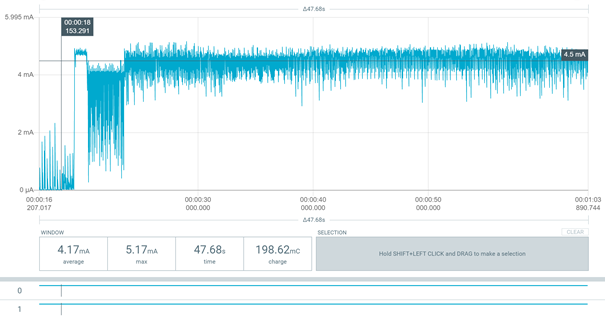  
And settles at an average power consumption of 4.5 mA:  
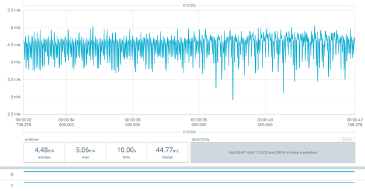  
The process of initializing takes about 2 min and 58 s.   
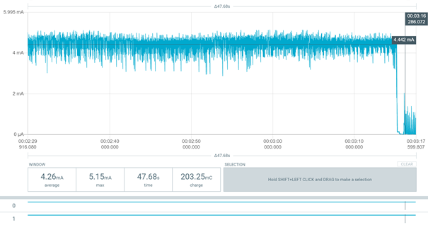  
While logging the energy consumption is about 20 μA higher than before.  

#### High-Performance Mode 
In high-performance mode, before initializing the flash, an average of 135,26 μA is consumed. That is 6 μA more than in low power mode.  
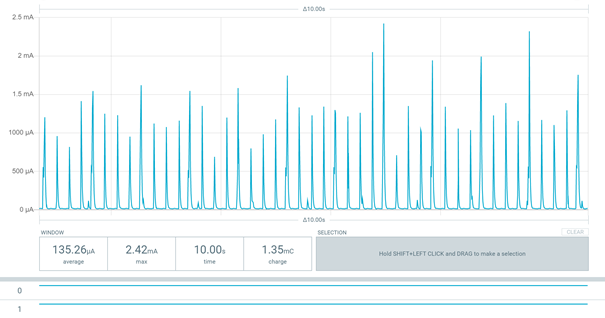  
When initializing the falsh, the power consumption goes up as seen before:  
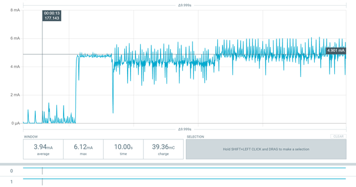  
The average power consumption reached is 0,43 mA higher than in low power mode:   
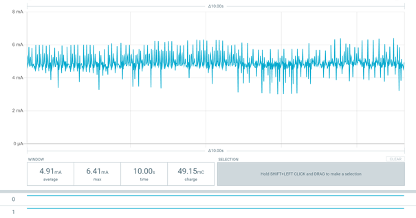  
But on the other hand, the process of initializing takes about 1 min and 42 s that is 1 min and 16 s less than in low power mode.  
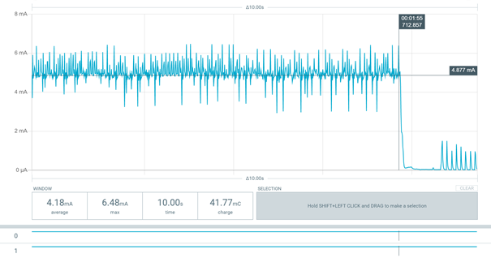  
To evaluate the energy consumption and time difference during flash initialization, the electric power for each mode is calculated:  
Supply voltage: $V_{cc} = 3V$  
Initialization time: $t_{init\_lp}=178 s$ ,  $t_{init\_hp}=102 s$  
Current: $I_{avg\_hp}=4,48 mA$ ,  $I_{avg\_hp}=4,91 mA$  
*Electric power*  
Low-Power: $W_{lp}=3 V∙178 s∙4,43 mA=2,37 Ws$  
High-Performance: $W_{hp}=3 V∙102 s∙4,91 mA=1,50 Ws$  

To reduce the overall power consumption, in normal operation the low power mode is used. Only during flash initialization, the high-performance mode is selected.   

### GitHub Issue #11 Write Performance on External Flash 
In this issue limitations due to the write performance of the flash or due to the SPI bus speed are evaluated.  
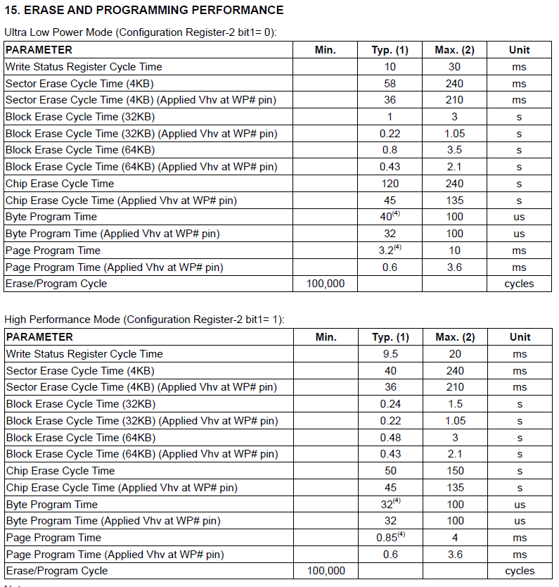  
The max. page program time is 10 ms in low power mode. Worst case - 4 write function calls:  
1. New sector - sector header required  
2. Data header  
3. Data passing over a page border  
4. rest of the data on the next page  
That results in a maximum of 40ms write time.  
The data sent in one SPI message is at least 144 byte, therefore 256 bytes is assumed for further calculations. That results in a transmission time of $\frac{256\bullet8}{8 MHz} = 0,256 ms$. This time is needed for each time the write function is called, which results in an overall worst case time of ~$41ms$ Assuming data is logged with a frequency of 500 Hz, the timeperiod between two write actions is $32\bullet\frac{1}{500 Hz}=64ms$ which is 1.5 times the time consumed for writing (worst case).  
A test with 100Hz and 200Hz frequency at 12Bit resolution (about 200000 byte) workes without an issue.