# PyCharm 
PyCharm is a Python IDE from JetBrains which offers nice features like Remote Deploy 
and repository management. For students PyCharm is free to use. You just must make a user 
account with your university Email on the JetBrains website.

## PyCharm Git Repository

1. Open a new Project.

2. Go to VCS and select Get from Version Control

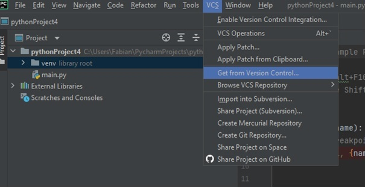

3. Click on GitHub
4. Click on Login via GitHub
5. You get redirected to a JetBrains site. 6. Click on “Authorize in GitHub”
6. Enter your credentials

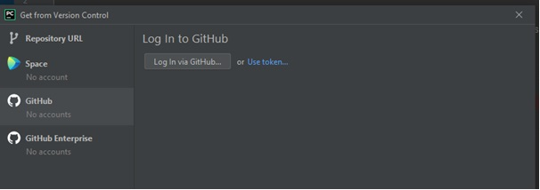

7. If it is successful choose the gateway repository from the list and click “clone”. 

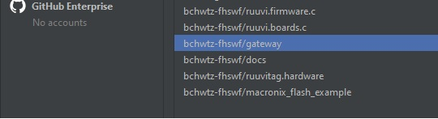

> If the Error message “Git is not installed” appears you can click on it to install on your machine. 
  After git is installed you have to repeat the steps 2. 3. 7. 

Afterwards your IDE should looks like this:

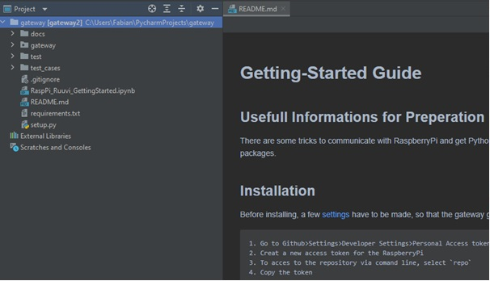

You can now work within the gateway code. To change the branch, where you are working, go to the right bottom corner of PyCharm.
And click on the “branch” symbol. All  branches in the repository are shown pick your branch and press Checkout.

## RemoteDeploy

To run the code on your raspberry pi you must make a remote deploy connection. 
We show you how to do this in this chapter:

1. Open Tools
2. Choose Deployment
3. Click on Configutarion

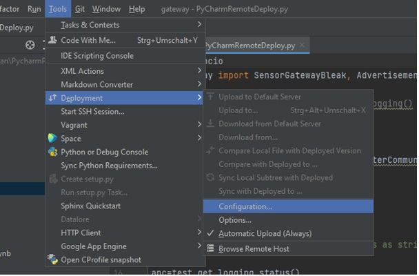

4. Press the plus sign in the top left corner of the deployment window:

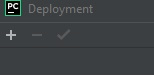

5. Choose SFTP and give the server a name.

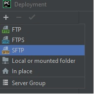

6. Press the “…” Button next to SSH configuration and press the plus sign in the top left corner.

7. Now enter the Ip from your pi. Which you can find out with Chaper XX. Enter the pi User name and your pi password.

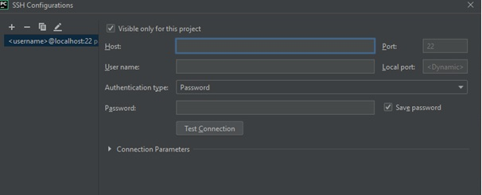

8. Test the connection with the Test Conenction Button. Accept the upcoming windows. If the connection is successful press the ok button.

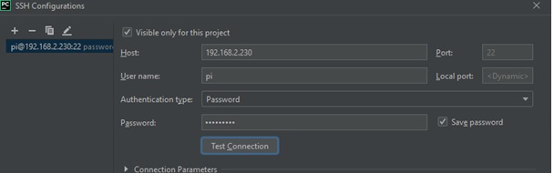

9. Now we must choose the deployment path. Change to the mappings tab and click on the folder Symbol next to Deployment Path:
   + Choose your file path via dropdown. Note the file must be in the home directory to prevent failures.

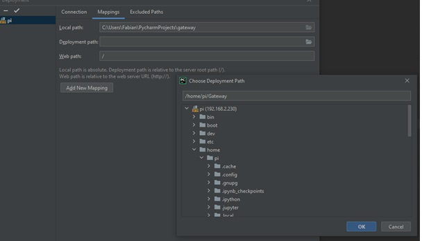

10. Click File > Settings

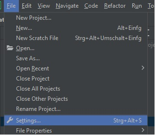

11. Go to Python Interpreter and click the sprocket on the right sight 

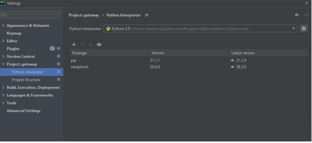

12. Choose add and click on SSH Interpreter and tick Existing Server configuration.

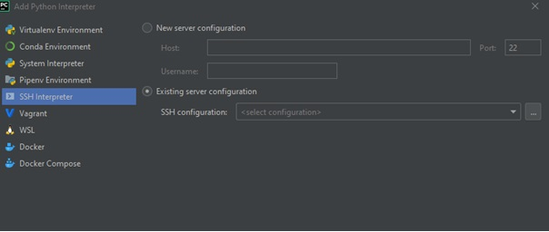

13. Choose your ssh connection and click next

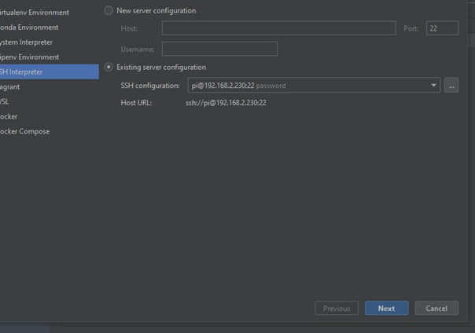

14. Change your Sync folder. Click on Folder icon on the right side

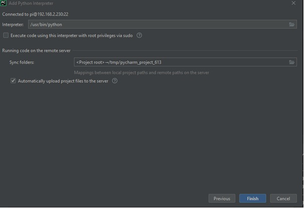

15. Click on the Remote Path side again on the Folder Symbol
    + Select your path from 9

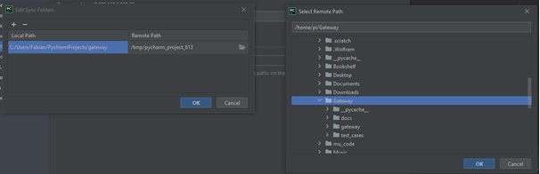

16. Click ok buttons until your back on your main screen.
17. If installations are requiered press the „Install requirements in the top right corner

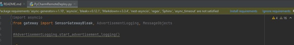

18. Now you can run the code on remote. All changes will be transmitted automatically to the raspberry pi
