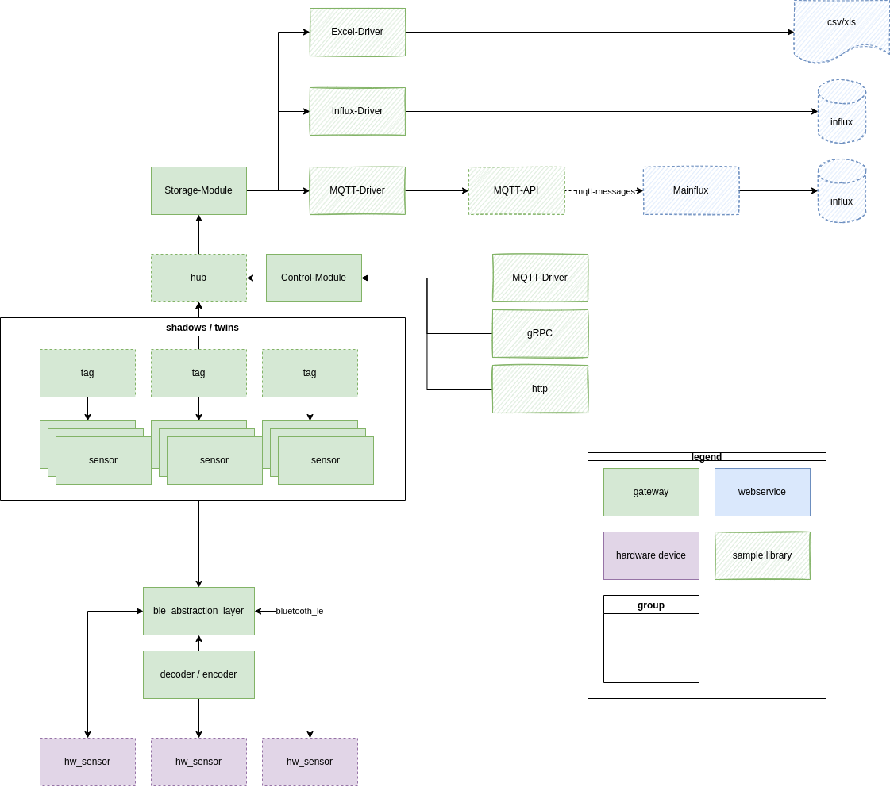
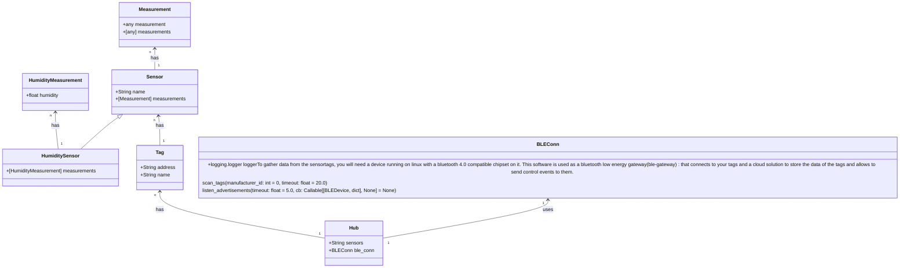
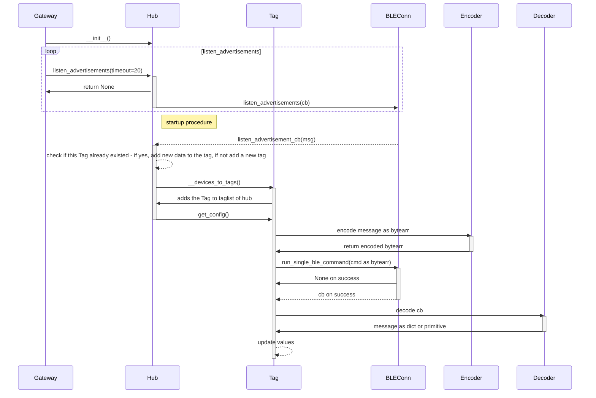

# Introduction
To gather data from the sensortags, you will need a device running on linux with a bluetooth 4.0 compatible chipset on it. This software is used as a bluetooth low energy gateway (ble-gateway) that connects to your tags and a cloud solution to store the data of the tags and allows to send control events to them.

The gateway-software consists of three microservices:  
- python bluetooth low energy implementation  
- go connector to a mongo db  
- go command and control commandline interface  

The microservices connect to each other using the MQTT protocol. RabbitMQ is used as a MQTT-broker.

  
  
The block components of this diagram should be interpreted as functional blocks, not as the implementation itself. The functional blocks are either implemented as python classes or as a whole module.   

As a brief introduction to the python library it makes sense to have a view on this class diagram of the library:

In the diagram you can see the actual links and references of the different classes inside the library. If you need the implementation reference for a single class in this diagram, just click on its box and you will be forwarded to the correct page.

This is how the gateway listens for advertisements and sets up new tags:

