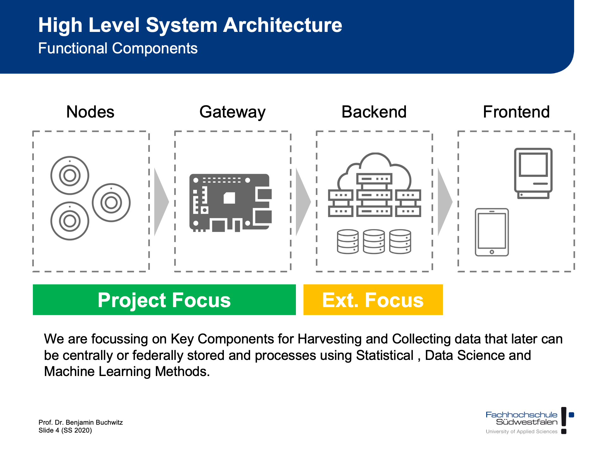
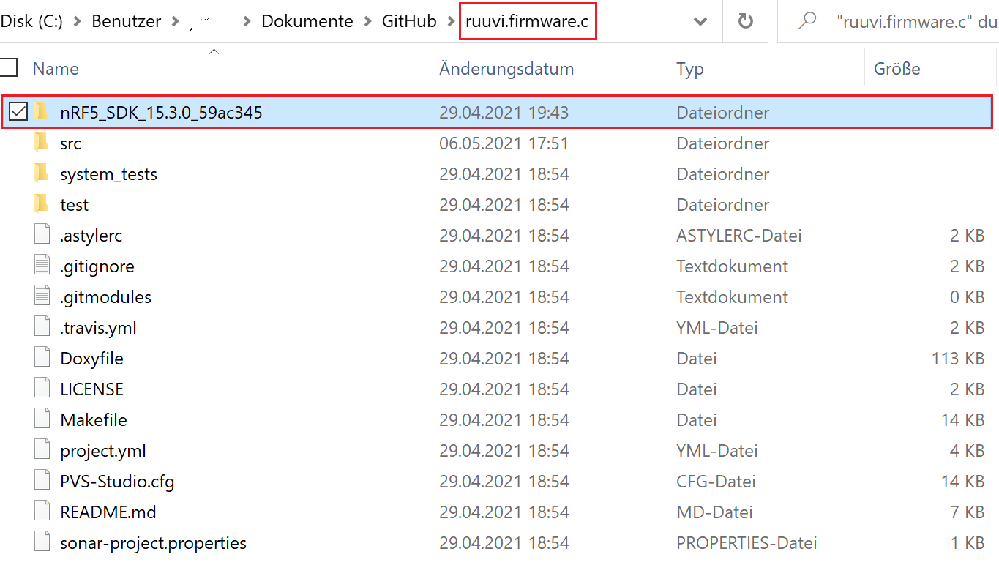
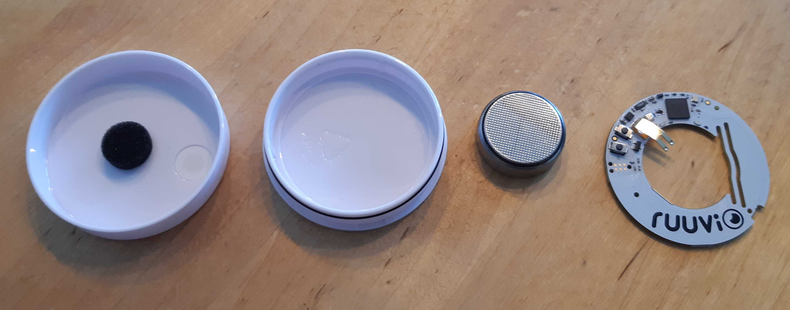
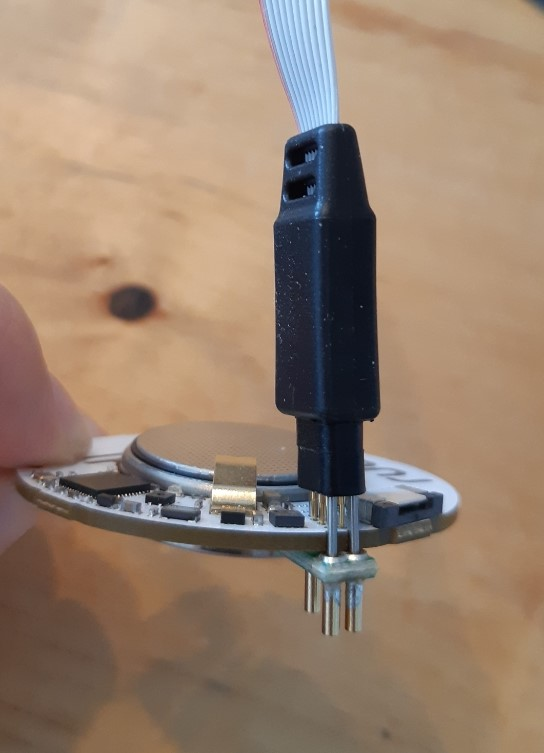
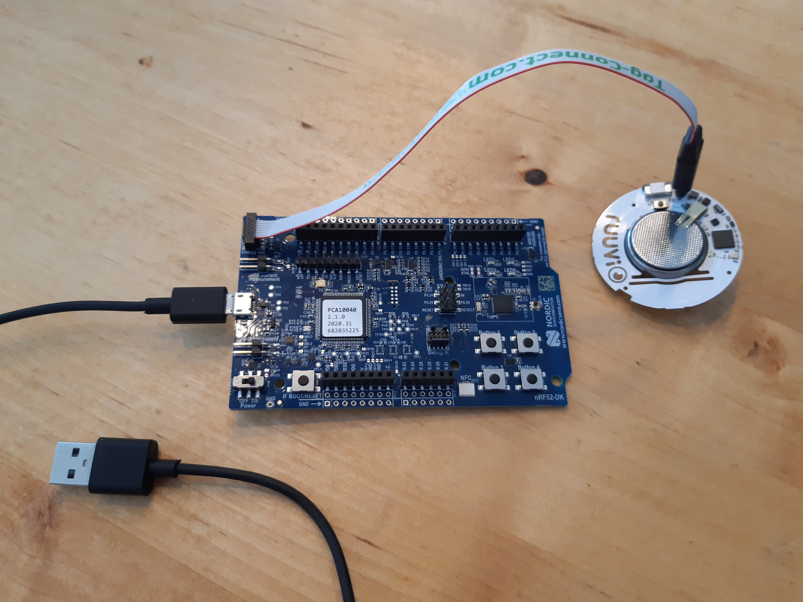
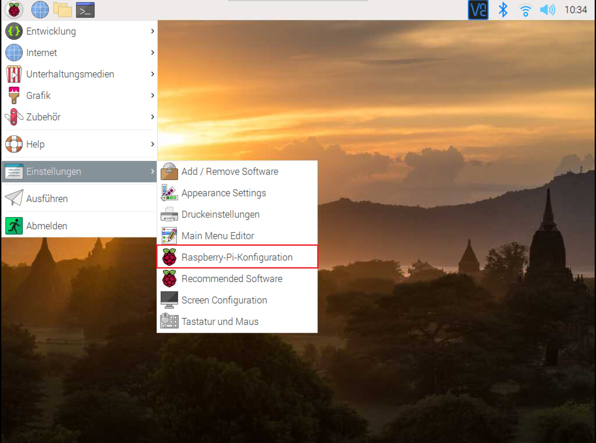
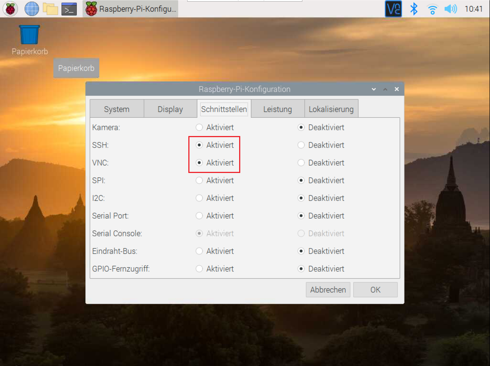
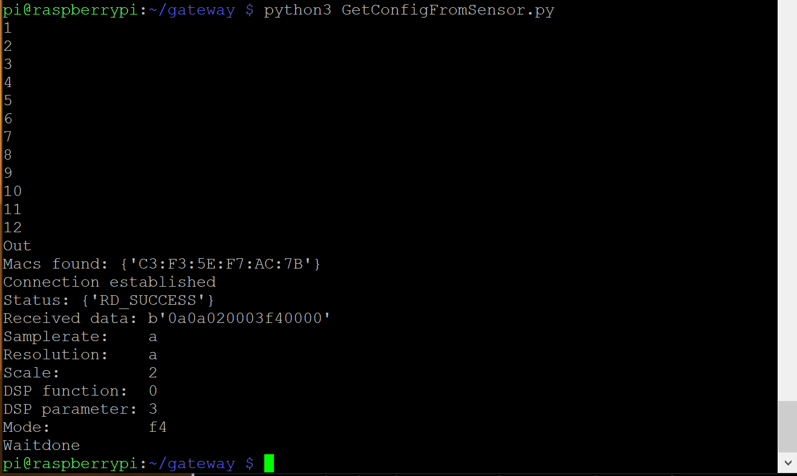

# Sensor and Gateway Setup



## Sensor Dev Env

This Chapter is a short guide for setting up your development environment. Until you receive your hardware you can start with installing the necessary software.

### Software Setup

1. Download “Segger Embedded Studio for ARM 5.10d” (https://www.segger.com/downloads/embedded-studio)

2. Download nRF5_SDK_15.3.0_59ac345.zip (https://developer.nordicsemi.com/nRF5_SDK/nRF5_SDK_v15.x.x/)

3. Clone https://github.com/bchwtz-fhswf/ruuvi.firmware.c. Copy the extracted ZIP from 2. Inside the cloned folder (If you don’t know how to clone a git repository look at https://git-scm.com/book/en/v2/Git-Basics-Getting-a-Git-Repository or search on google/youtube)
It should look like this:


4. Open SEGGER and click “File” -> “Open Solution”, navigate to the cloned repository and open “ruuvi.firmware.c”. The project should now be inside SEGGER.

5. Search “Project ‘ruuvitag_b’” on the left inside SEGGER, right-click and choose “Set as Active Project”.

6. To pull the current version of all subrepositories, please use `make pull` in any bash-compatible shell.

### Alternative Software Setup (building releases)

1. Install docker (either docker-desktop or on linux your preferred docker package).

2. If you use Windows or Mac, please set your preferred RAM-size and CPU-Count in the docker-desktop-app.

3. Run `docker_build.sh` in any bash-compatible environment (e.g. [git-bash](https://gitforwindows.org/))

This leaves you with the release-binaries in `src/targets/ruuvitag_b/arm_gcc/`.
For further details refer to the [README.md](https://github.com/bchwtz-fhswf/ruuvi.firmware.c#using-the-build-toolchain-inside-docker-recommended-way)

### Hardware Setup

1. Open your ruuvi tag, take PCB & battery out (you can do so with a little screwdriver or by gently pulling on the battery clip)


2. Connect the “Tag Connector” cable + plug to your ruuvi tag

3. Connect the other side of the tag connector to the Debug out slot on the Nordic SDK

4. Connect your SDK over USB with your PC


5. Turn on the switch at the bottom left

6. To test if everything is right, open SEGGER and click “Target”->”Connect J-Link”. SEGGER should connect to your SDK

7. To flash your ruuvi tag with the cloned firmware, click “Target”->”Erase All”, afterwards click “Build”->”Build and Run” 


## Gateway Dev Env
### Raspberry connection via screen

1. Connect your Raspberry Pi to a screen via Micro HDMI if you have an external screen.

2. Connect your Raspberry to your WiFi

3. Activate SSH and VNC by clicking on the raspberry on the top left -> Preferences -> Raspberry-Pi-Configuration->Interfaces, change SSH and VNC to activated



Skip next steps and jump directly to number 9!

### Raspberry connection without a screen (headless setup)
Documentation follows this video: https://www.youtube.com/watch?v=rGygESilg8w

4. Take the SD-card of the Raspberry and put it in the card reader of your PC.

5. Go to https://www.raspberrypi.com/software/ and download the Raspberry Pi OS Imager if not yet installed.

6. Open Raspberry Pi Imager.

7. Install operating system and choose the Raspberry Pi OS (normally recommended).

8. Choose your SD card as storage and click "WRITE".   

### Set up PuTTY and finalize connection to Raspberry

9. On your PC, download PuTTY (https://www.putty.org/)

10. Get your Raspberry’s IP-Adress by opening a command line on your PC and and type 
```{bash, eval=F}
ping raspberrypi.local
```

11. Open PuTTY, type the IP-Adress into the Host Name field. You can save it by entering a name into the “Saved Sessions” field and pressing “save”. Afterwards select “open”.

12. When asked for the username type 
```{bash, eval=F}
pi
```
and afterwards enter your password. If you did not change it on Raspberry’s startup it should be 
```{bash, eval=F}
raspberry
```

13. To clone the Gateway repository (https://github.com/bchwtz-fhswf/gateway) onto your pi, you need a SSH Key which is connected to your account. Generate it by following the instructions in https://docs.github.com/en/github/authenticating-to-github/generating-a-new-ssh-key-and-adding-it-to-the-ssh-agent for Linux (you dont have to pass it to a key agent) and add it to your account by following the instructions in https://docs.github.com/en/github/authenticating-to-github/adding-a-new-ssh-key-to-your-github-account 

14. Clone the gateway repository to your raspberry by typing 
```{bash, eval=F}
git clone git@github.com:bchwtz-fhswf/gateway.git
```
into the PuTTY window connected to your raspberry. When asked, enter the SSH Key password you initiated while generating the key.

15. Before you are able to execute some of the scripts, you have to install some Python modules by typing or pasting the following commands. (You can paste into a PuTTY window by right-clicking) 
```{bash, eval=F}
pip3 install ruuvitag_sensor
pip3 install crcmod
pip3 install pygatt
pip3 install interruptingcow
sudo apt-get install bluez bluez-hcidump
```

16. To try if your setup is working, navigate to the cloned repo and type “python3 GetConfigFromSensor.py”. You should see something like this:


17. To properly use the gateway library, type “python3” into the putty command window. This activates an interactive python session. Type 
```{bash, eval=F}
import SensorGatewayCommunication
```
Afterwards you can type
```{bash, eval=F}
test=SensorGatewayCommunication.RuuviTagAccelerometerCommunication()
test.activate_logging_at_sensor()
```
Wait a few seconds and type
```{bash, eval=F}
test.get_last_sample_acceleration_data()
```
Wait 2 minutes and type
```{bash, eval=F}
abc=test. get_acceleration_data () 
```
You should see some x,y and z acceleration data after executing the get_last_sample_acceleration_data function. After get_acceleration_data, you should see a lot of hex data flooding through your screen. They get saved inside a .csv file for further analysis. 

CONGRATULATIONS! YOUR SETUP IS READY!!!


```{bash, eval=F}
sudo apt-get install libatlas-base-dev
sudo apt-get install python3-pandas
sudo apt-get install python3-numpy
```

